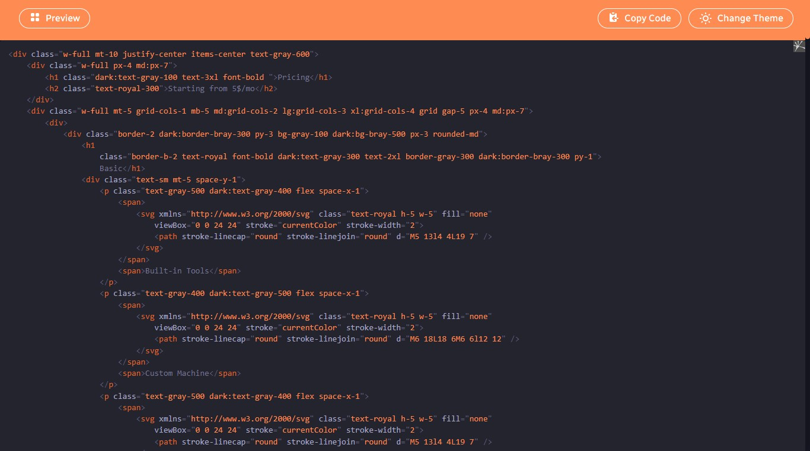

## TailwindCss UIs

Free open-source UI components made with TailwindsCss.

## Preview




## Installation

Add these configs to your `tailwind.config.js` file.

```js
module.exports = {
  darkMode: "class",
  content: [...],
  theme: {
    extend: {
      colors: {
        royal: {
          DEFAULT: "#FE8C52",
          50: "#FEBA96",
          100: "#FEB48F",
          200: "#FEAA80",
          300: "#FEA070",
          400: "#FE9661",
          500: "#FE8C52",
          600: "#FE8243",
          700: "#FE7834",
          800: "#FE6E24",
          900: "#FE6415",
        },
        bray: {
          DEFAULT: "#191926",
          50: "#343450",
          100: "#31314B",
          200: "#2B2B42",
          300: "#252538",
          400: "#1F1F2F",
          500: "#191926",
          600: "#13131D",
          700: "#0D0D14",
          800: "#07070A",
          900: "#010101",
        },
      },
    },
  },
  plugins: [
    require("@tailwindcss/forms")({
      strategy: "class",
    }),
    require("@tailwindcss/typography"),
    require("@tailwindcss/aspect-ratio"),
  ],
};
```
